# Program Kasir Mandiri

## What
"Program Kasir Mandiri" adalah program yang dapat dipakai untuk membantu pelanggan supermarket mendaftarkan barang belanjaan serta menghitung total pembayaran sesuai dengan diskon yang berlaku.

## Why
Dibutuhkan program yang user-friendly sehingga pelanggan dapat menggunakan layanan kasir self-service dengan lancar.

## Features
Dengan "Program Kasir Mandiri", pelanggan dapat melakukan operasi berikut.
1. Menu untuk menambahkan item
2. Menu untuk memperbaharui nama item
3. Menu untuk memperbaharui jumlah item
4. Menu untuk memperbaharui harga item
5. Menu untuk mengecek list item yang sudah ditambahkan
6. Menu untuk menghapus salah satu item yang sudah ditambahkan
7. Menu untuk menghapus seluruh list item yang sudah ditambahkan


### Initialization
Membuat sebuah dictionary dengan key: nama_item, jml_item, dan harga_item. Detail tiap item akan disimpan dalam sebuah list di dalam masing-masing key.
```python
class Transaction():
    def __init__(self):
        self.barang = {'nama_item':[], 'jml_item':[], 'harga_item':[]}
        print(u'\u2500' * 75)
        print('PROGRAM KASIR MANDIRI'.center(75,'-'))
        print(u'\u2500' * 75)
        
        self.add_item()
``` 
Program dimulai dengan membuat sebuah class object, dilanjutkan dengan penambahan item pertama.
```python
trx = Transaction()
```

### menu()
Method untuk menampilkan menu yang terdapat di Program Kasir Mandiri. Menerima input untuk pemilihan menu berupa nilai 0-7. Program akan berhenti meminta input setelah mendapati nilai input yang tidak sesuai sebanyak tiga kali.

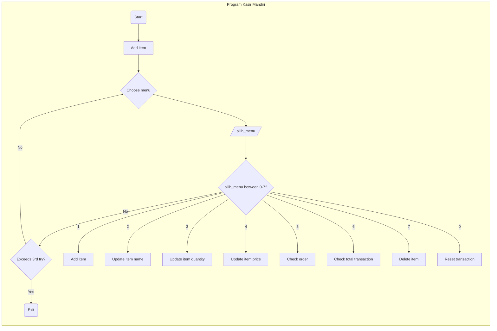

### validasi_angka()
Method untuk melakukan validasi input numerik. Akan me-return nilai `None` setelah menemui input yang tidak sesuai sebanyak tiga kali.

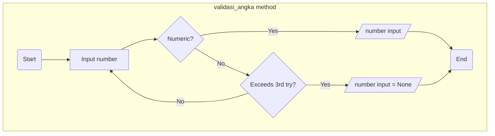


### add_item()
Method untuk menambahkan item belanjaan secara interaktif. Melakukan validasi input `nama_item` agar tidak berisi string kosong serta validasi jenis data numerik untuk input `jml_item` dan `harga_item`.
        
    Expected input
    --------------
    nama_item : str
        Berisi nama item belanjaan, minimal 1 karakter
    jml_item : float
        Jumlah item belanjaan
    harga_item : float
        Harga item belanjaan per satuan unit dalam rupiah

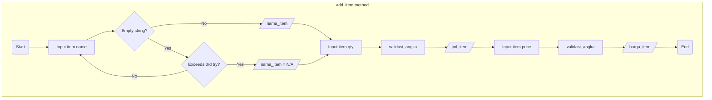

```python
def add_item(self):
    barang = self.barang
    
    nama_item = 'N\A'
    i = 0
    while i < 3:               
        nama_item = input('Nama Item: ')
        if nama_item.strip() != '':
            break
        else:
            print('Tolong masukkan nama item.')
            i += 1
    
    jml_item = self.validasi_angka('Jumlah Item: ')
    harga_item = self.validasi_angka('Harga Item per Unit: ')
            
    barang['nama_item'].append(nama_item)
    barang['jml_item'].append(jml_item)
    barang['harga_item'].append(harga_item)
```

### cari_barang()
Method untuk mencari indeks dari item di dalam list barang`['nama_item']`. Jika item tidak ada di list, maka akan me-return `None`.
        
    Parameters
    ----------
    nama_item : str
        Berisi nama item belanjaan
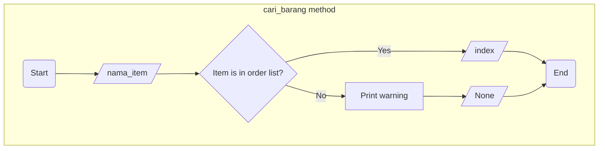


### update_barang()
Method untuk merperbaharui detail item (nama, jumlah, harga)
        
    Parameters
    ----------
    nama_item : str
        Berisi nama item belanjaan
    detail_barang : {'nama_item', 'jml_item', 'harga_item'}
        Jenis detail item yang ingin diganti
    detail_barang_updated:
        Detail barang yang terbaru

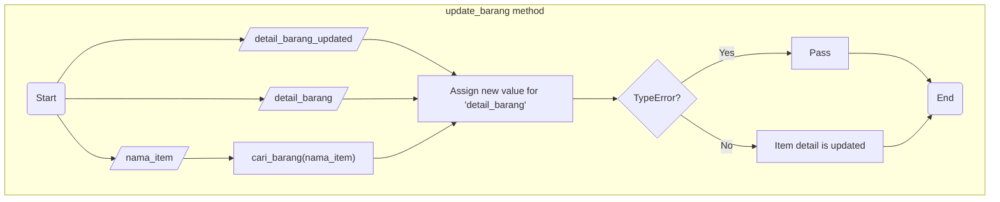


### update_item_name()
Method untuk memperbaharui nama item. Pengguna akan dituntun untuk memasukkan input secara interaktif.
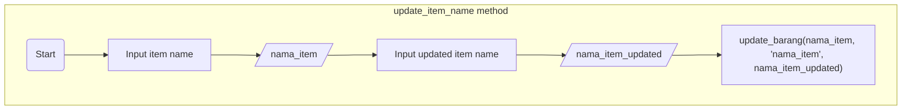


### update_item_qty()
Method untuk memperbaharui jumlah item. Pengguna akan dituntun untuk memasukkan input secara interaktif. Input jumlah harga akan melalui validasi sebelum akhirnya jumlah item diperbaharui.

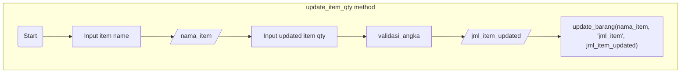

### update_item_price()
Method untuk memperbaharui harga item. Pengguna akan dituntun untuk memasukkan input secara interaktif. Input jumlah harga akan melalui validasi sebelum akhirnya jumlah item diperbaharui.

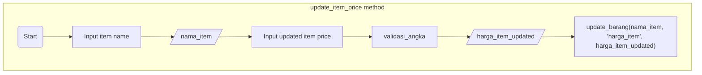

### delete_item()
Method untuk menghapus item yang sudah dimasukkan.

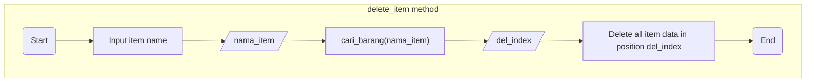

### check_order()
Method untuk mengecek keseluruhan daftar item serta total harga masing-masing item.
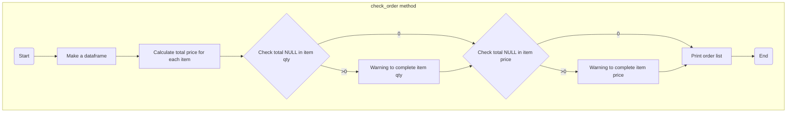

### total_price()
Method untuk menghitung total pembayaran serta menghitung diskon yang didapatkan jika berlaku.

Ketentuan diskon:
- total harga > Rp 500,000: diskon 10%
- total harga > Rp 300,000: diskon 8%
- total harga > Rp 200,000: diskon 5%
  
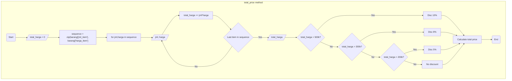

### reset_transaction
Method untuk menghapus semua item dalam list belanjaan.
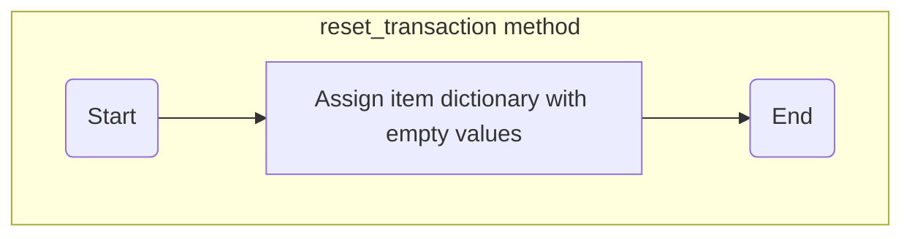

## Demo

### Test Case 1: Start program and add item

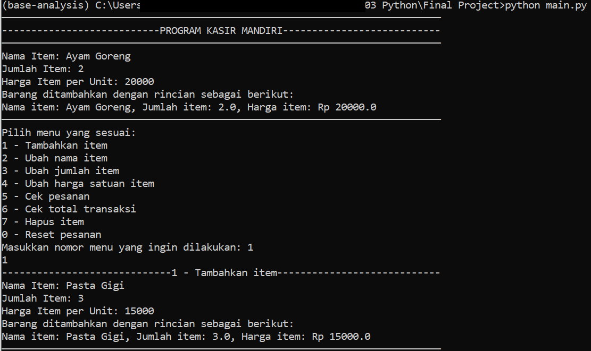

### Test Case 2: Delete item

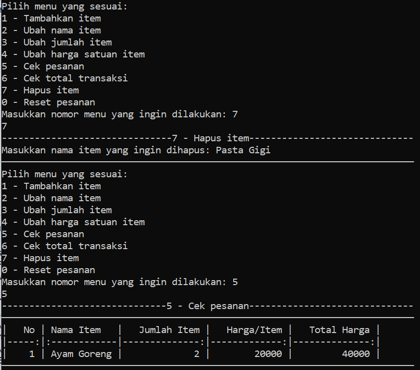

### Test Case 3: Reset transaction

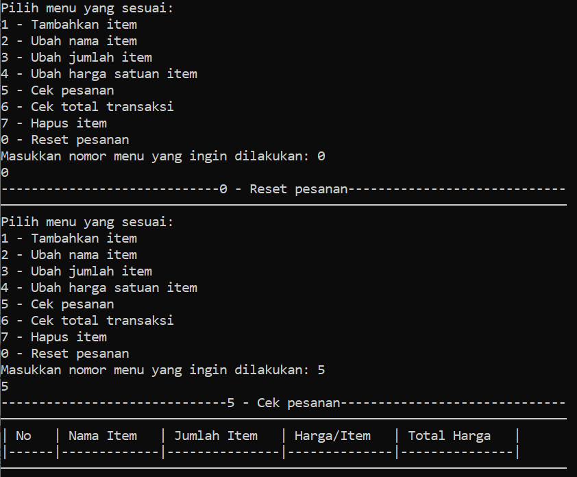

### Test Case 4: Check total price

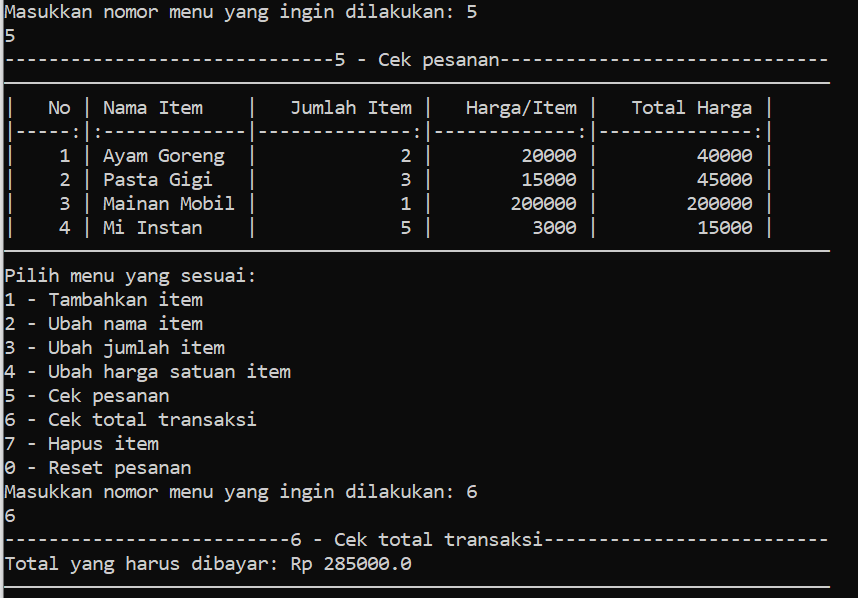